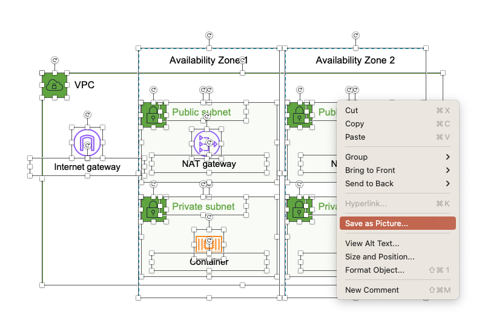
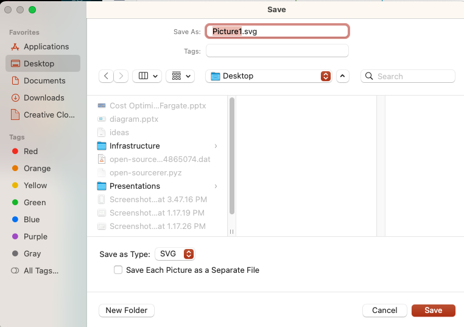

### SVG diagram process

1. Download the AWS Infrastructure tookit for Powerpoint: https://aws.amazon.com/architecture/icons/
2. Open this Powerpoint and copy and paste elements from it to a new PowerPoint deck, while following it’s best practices for creating architecture diagrams, with the following modifications:
    1. Avoid solid background color blocks wherever possible, but when necessary for stylistic or grouping reasons background color blocks should be set to 80% transparency, so that they work on both solid white and solid black backgrounds
    2. All text should be set to solid black: `#000000`. This will allow the SVG importer to detect text labels that need to be converted from black to white when switching from light mode to dark mode.
    3. Use only default Arial font for text labels (no Amazon Ember). This SVG is rendering for the web, and Ember will not work.
    4. For arrows and lines, please do not use black. Instead use a neutral gray, blue, or other similar color that shows up well on both dark and light backgrounds
3. Click and drag to select all elements on your Powerpoint slide, then right click on any element to open the context menu, and click “Save as Picture”

5. Make sure that you select SVG file format under “save as type” in the file dialog.

7. Add both your PPT file and your SVG to the `pattern/<pattern-name>` folder that holds your pattern content. You can now import your SVG into the Markdown content using the following syntax: `!!! @/pattern/<pattern-name>/diagram.svg`
8. Please make sure to use the dark/light mode toggle to ensure that your SVG looks good on both light and dark backgrounds.